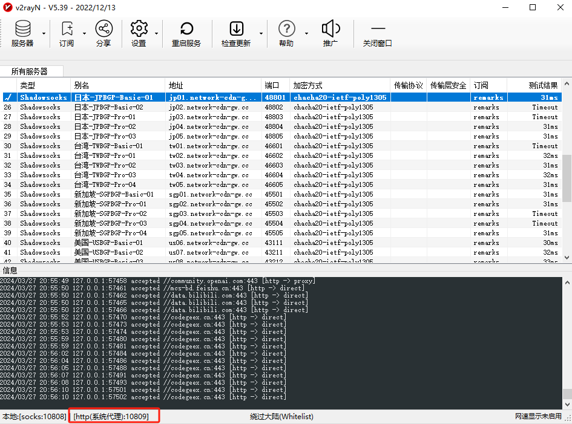
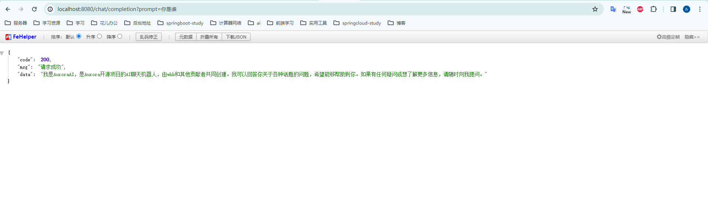

---
tags:
  - SpringBoot
  - chatGPT
---

# SpringBoot整合chatGPT，实现一个后端AI聊天机器人


> 本文作者：[程序员Aurora](/author.md)
>
> 本站地址：[https://codenote.wuhobin.top](https://codenote.wuhobin.top)


 项目背景：SpringBoot3.1.0, JDK17


## 1. 创建项目, 引入依赖

通过idea创建SpringBoot项目, SpringBoot版本为3.1.0, JDK版本为17, 创建完成后引入下方依赖
```xml
    <properties>
        <java.version>17</java.version>
        <maven.compiler.source>17</maven.compiler.source>
        <maven.compiler.target>17</maven.compiler.target>
        <project.build.sourceEncoding>UTF-8</project.build.sourceEncoding>

        <spring.boot.version>3.1.0</spring.boot.version>
        <hutool.version>5.8.20</hutool.version>
    </properties>

    <dependencyManagement>
        <dependencies>
            <dependency>
                <groupId>org.springframework.boot</groupId>
                <artifactId>spring-boot-dependencies</artifactId>
                <version>${spring.boot.version}</version>
                <type>pom</type>
                <scope>import</scope>
            </dependency>

        </dependencies>
    </dependencyManagement>

    <dependencies>

        <dependency>
            <groupId>org.springframework.boot</groupId>
            <artifactId>spring-boot-starter-web</artifactId>
            <exclusions>
                <exclusion>
                    <groupId>org.springframework.boot</groupId>
                    <artifactId>spring-boot-starter-logging</artifactId>
                </exclusion>
                <exclusion>
                    <groupId>org.apache.tomcat.embed</groupId>
                    <artifactId>tomcat-embed-core</artifactId>
                </exclusion>
            </exclusions>
        </dependency>

        <dependency>
            <groupId>org.springframework.boot</groupId>
            <artifactId>spring-boot-starter-log4j2</artifactId>
        </dependency>

        <dependency>
            <groupId>org.projectlombok</groupId>
            <artifactId>lombok</artifactId>
            <scope>provided</scope>
        </dependency>

        <dependency>
            <groupId>org.apache.commons</groupId>
            <artifactId>commons-lang3</artifactId>
        </dependency>

        <dependency>
            <groupId>org.springframework.boot</groupId>
            <artifactId>spring-boot-starter-undertow</artifactId>
        </dependency>

        <dependency>
            <groupId>org.springframework.boot</groupId>
            <artifactId>spring-boot-starter-test</artifactId>
        </dependency>

        <dependency>
            <groupId>cn.hutool</groupId>
            <artifactId>hutool-all</artifactId>
            <version>${hutool.version}</version>
        </dependency>

        <dependency>
            <groupId>com.theokanning.openai-gpt3-java</groupId>
            <artifactId>service</artifactId>
            <version>0.18.2</version>
        </dependency>


    </dependencies>

    <build>
        <plugins>
            <plugin>
                <groupId>org.apache.maven.plugins</groupId>
                <artifactId>maven-compiler-plugin</artifactId>
                <configuration>
                    <source>${maven.compiler.source}</source>
                    <target>${maven.compiler.target}</target>
                    <encoding>${project.build.sourceEncoding}</encoding>
                </configuration>
            </plugin>
            <plugin>
                <groupId>org.springframework.boot</groupId>
                <artifactId>spring-boot-maven-plugin</artifactId>
                <executions>
                    <execution>
                        <goals>
                            <goal>repackage</goal>
                        </goals>
                    </execution>
                </executions>
            </plugin>
        </plugins>
        <pluginManagement>
            <plugins>
                <plugin>
                    <groupId>org.springframework.boot</groupId>
                    <artifactId>spring-boot-maven-plugin</artifactId>
                    <version>${spring.boot.version}</version>
                    <executions>
                        <execution>
                            <goals>
                                <goal>repackage</goal>
                            </goals>
                        </execution>
                    </executions>
                </plugin>
            </plugins>
        </pluginManagement>
    </build>
```
上面依赖中, 我们引入了`com.theokanning.openai-gpt3-java`依赖，它是openAI官方提供的一个Java客户端，用于与OpenAI的GPT-3 API进行交互。

github地址：[https://github.com/TheoKanning/openai-java](https://github.com/TheoKanning/openai-java)


## 2. 添加配置

在`application.properties`文件中添加openAI的API密钥，大模型类别，代理地址以及代理端口，如下：

```properties
# chatGpt keys
api.chatGptKey = apiKey
# 代理地址
api.proxyHost = 127.0.0.1
# 代理端口
api.proxyPort = 10809
# ai模型
api.model = gpt-3.5-turbo
# ai模型最大tokens
api.maxTokens = 2048
```

**上面配置中我们配置的代理端口和代理地址是需要本机翻墙连接vpn，否则无法访问openAI的API接口。翻墙方法自行解决，或者联系我获取教程。**

具体的端口查看如下图：



## 3. 创建`OpenAiProperties`文件

该文件主要是为了映射在第二步中编写的配置，文件内容如下

```java
@Data
@Configuration
@ConfigurationProperties(prefix = "api")
public class OpenAiProperties {

    private String chatGptKey;

    private String proxyHost;

    private Integer proxyPort;

    private String model;

    private Integer maxTokens;
}
```


## 4. 配置`OpenAiConfiguration`配置

该配置主要是为了创建一个`OpenAiConfiguration`的bean，并将其注入到`OpenAiService`中，以便后续调用。

```java
@Configuration
public class OpenAiConfiguration {
 
    @Autowired
    private OpenAiProperties openAiProperties;

    /**
     * 需要本地开启vpn代理，代理设置代理地址以及端口，才可以访问openAi接口
     * chatGpt service
     * @return OpenAiService
     */
    @Bean
    public OpenAiService openAiService(){
        ObjectMapper mapper = defaultObjectMapper();
        Proxy proxy = new Proxy(Proxy.Type.HTTP, new InetSocketAddress(openAiProperties.getProxyHost(), openAiProperties.getProxyPort()));
        OkHttpClient client =  defaultClient(openAiProperties.getChatGptKey(), Duration.ofSeconds(10000))
                .newBuilder()
                .proxy(proxy)
                .build();
        Retrofit retrofit = defaultRetrofit(client, mapper);
        OpenAiApi api = retrofit.create(OpenAiApi.class);
        return new OpenAiService(api);
    }
}
```


## 5. 创建`ChatService`文件，提供一个chat接口

```java
public interface ChatService {

    String chat(String prompt);

}

// 编写该接口实现类 
```java
@Service
@Slf4j
public class ChatServiceImpl implements ChatService {

    @Autowired
    private OpenAiService openAiService;

    @Autowired
    private OpenAiProperties openAiProperties;

    @Override
    public String chat(String prompt) {
        ChatMessage chatMessage = new ChatMessage();
        chatMessage.setRole("system");
        chatMessage.setContent("你的名字叫AuroraAI,你是Aurora开源项目的AI聊天机器人，你的创造者是whb以及其他贡献者。当有人问你问题时你只能回答500字以内");

        ChatMessage userMessage = new ChatMessage();
        userMessage.setRole("user");
        userMessage.setContent(prompt);
        List<ChatMessage> messages = new ArrayList<ChatMessage>();
        messages.add(chatMessage);
        messages.add(userMessage);

        ChatCompletionRequest completionRequest = ChatCompletionRequest.builder()
                .messages(messages)
                .model(openAiProperties.getModel())
                .temperature(1.0)
                .topP(0.9)
                .frequencyPenalty(0.0)
                .presencePenalty(0.6)
                .maxTokens(openAiProperties.getMaxTokens())
                .build();
        ChatCompletionResult chatCompletion = openAiService.createChatCompletion(completionRequest);
        if (ObjectUtils.isEmpty(chatCompletion) || ObjectUtils.isEmpty(chatCompletion.getChoices()) || ObjectUtils.isEmpty(chatCompletion.getChoices().get(0))){
            return "抱歉，我无法回答你的问题，请稍后再试。如果问题仍然存在，请尝试其他问题或联系项目维护者。";
        }
        String reply = chatCompletion.getChoices().get(0).getMessage().getContent();
        log.info("Chat completion result: {}", chatCompletion);
        return reply;
    }
}
```

## 6. 编写测试接口，测试

创建一个接口，主要用于调用chatService里面的方法

```java
@RestController
@RequestMapping("/chat")
public class ChatController {

    @Autowired
    private ChatService chatService;

    @GetMapping("/completion")
    public CommonResult completion(String prompt) {
        String chat = chatService.chat(prompt);
        return CommonResult.success(chat);
    }
}

```

## 7. 启动项目，测试接口

启动项目，访问接口，测试是否成功调用chatGpt

浏览器输入： [http://localhost:8080/chat/completion?prompt=%E4%BD%A0%E6%98%AF%E8%B0%81](http://localhost:8080/chat/completion?prompt=%E4%BD%A0%E6%98%AF%E8%B0%81)

出现下图，表示调用成功



完结撒花，相关视频会发布在哔哩哔哩，需要的小伙拌自行查看 

主页：[https://space.bilibili.com/495003013](https://space.bilibili.com/495003013)


<Vssue :title="$title" />