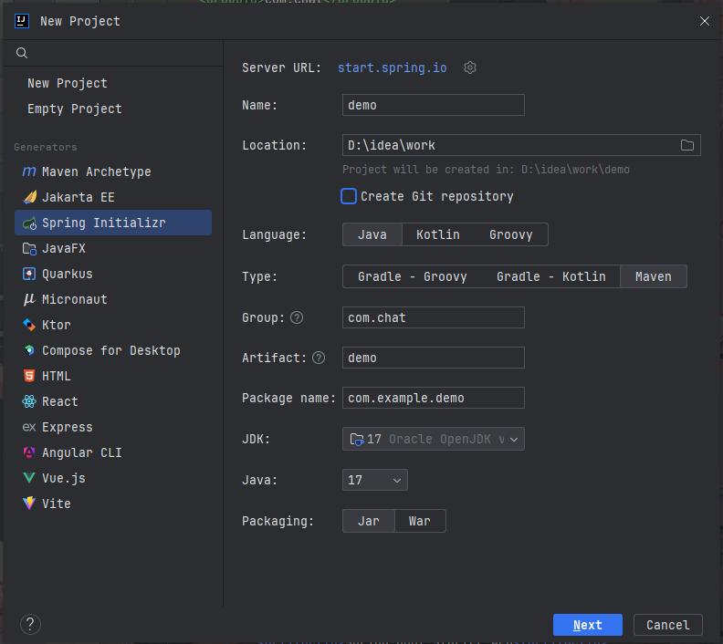
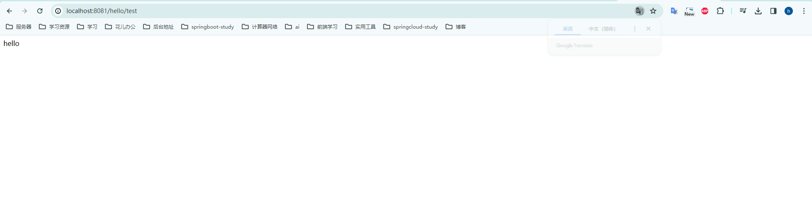

---
tags:
  - 项目搭建
  - 多模块项目
---

# 多模块项目搭建，依赖统一管理


> 本文作者：[程序员Aurora](/author.md)
>
> 本站地址：[https://codenote.wuhobin.top](https://codenote.wuhobin.top)


项目背景：Idea 2023.3.2 版本，使用 Maven 3.9.6 版本，JDK 17 版本，SpringBoot 3.1.0 版本。


## 1. 创建父工程

#### 1.1 通过Idea新建SpringBoot项目，选择 Maven 模式，，点击 Next 按钮。



#### 1.2 删除该项目下面除pom.xml外其他文件夹，并在pom.xml 文件下加入以下依赖

```xml
<?xml version="1.0" encoding="UTF-8"?>
<project xmlns="http://maven.apache.org/POM/4.0.0" xmlns:xsi="http://www.w3.org/2001/XMLSchema-instance"
         xsi:schemaLocation="http://maven.apache.org/POM/4.0.0 https://maven.apache.org/xsd/maven-4.0.0.xsd">
    <modelVersion>4.0.0</modelVersion>

    <groupId>com.wuhobin</groupId>
    <artifactId>java-study-module</artifactId>
    <version>1.0.0-SNAPSHOT</version>
    <packaging>pom</packaging>
    
    <properties>
        <java.version>17</java.version>
        <maven.compiler.source>17</maven.compiler.source>
        <maven.compiler.target>17</maven.compiler.target>
        <project.build.sourceEncoding>UTF-8</project.build.sourceEncoding>

        <spring.boot.version>3.1.0</spring.boot.version>
        <hutool.version>5.8.20</hutool.version>
    </properties>

    <dependencyManagement>
        <dependencies>
            <dependency>
                <groupId>org.springframework.boot</groupId>
                <artifactId>spring-boot-dependencies</artifactId>
                <version>${spring.boot.version}</version>
                <type>pom</type>
                <scope>import</scope>
            </dependency>


            <dependency>
              <groupId>cn.hutool</groupId>
              <artifactId>hutool-all</artifactId>
              <version>${hutool.version}</version>
            </dependency>
            
        </dependencies>

        
    </dependencyManagement>

  
    <build>
        <plugins>
            <plugin>
                <groupId>org.apache.maven.plugins</groupId>
                <artifactId>maven-compiler-plugin</artifactId>
                <configuration>
                    <source>${maven.compiler.source}</source>
                    <target>${maven.compiler.target}</target>
                    <encoding>${project.build.sourceEncoding}</encoding>
                </configuration>
            </plugin>
        </plugins>
        <pluginManagement>
            <plugins>
                <plugin>
                    <groupId>org.springframework.boot</groupId>
                    <artifactId>spring-boot-maven-plugin</artifactId>
                    <version>${spring.boot.version}</version>
                    <executions>
                        <execution>
                            <goals>
                                <goal>repackage</goal>
                            </goals>
                        </execution>
                    </executions>
                </plugin>
            </plugins>
        </pluginManagement>
    </build>

</project>

```

## 2. 创建子模块


#### 2.1 通过Idea新建SpringBoot项目，选择 Maven 模式，，点击 Next 按钮。


#### 2.2 修改子模块pom文件

```xml

<?xml version="1.0" encoding="UTF-8"?>
<project xmlns="http://maven.apache.org/POM/4.0.0" xmlns:xsi="http://www.w3.org/2001/XMLSchema-instance"
         xsi:schemaLocation="http://maven.apache.org/POM/4.0.0 https://maven.apache.org/xsd/maven-4.0.0.xsd">
    <modelVersion>4.0.0</modelVersion>
    <parent>
        <groupId>com.wuhobin</groupId>
        <artifactId>java-study-module</artifactId>
        <version>1.0.0-SNAPSHOT</version>
        <relativePath>../pom.xml</relativePath>
    </parent>

    <artifactId>module-common</artifactId>
    <version>0.0.1-SNAPSHOT</version>


    <dependencies>

        <!-- web支持-->
        <dependency>
            <groupId>org.springframework.boot</groupId>
            <artifactId>spring-boot-starter-web</artifactId>
        </dependency>


        <!--hutool 工具包 -->
        <dependency>
            <groupId>cn.hutool</groupId>
            <artifactId>hutool-all</artifactId>
        </dependency>

    
        <!--单元测试 -->
        <dependency>
            <groupId>org.springframework.boot</groupId>
            <artifactId>spring-boot-starter-test</artifactId>
            <scope>test</scope>
        </dependency>


    </dependencies>

```

#### 2.3 父pom引入子模块

在父pom中引入子模块，填入已下代码即可

```xml
<modules>
    <module>module-common</module>
</modules>
```

## 3. 创建测试接口

在子模块module-common中创建controller包，并创建HelloController类，代码如下

```java
/**
 * @author wuhongbin
 * @ClassName HelloController
 * @description: TODO
 * @date 2024年03月20日
 * @version: 1.0.0
 */
@RestController
@RequestMapping("/hello")
public class ChatController {

    @GetMapping("/test")
    public ResponseEntity test() {
        return ResponseEntity.ok("hello");
    }
}

```


浏览器访问：[http://localhost:8080/hello/test](http://localhost:8080/hello/test)



出现以上页面，则表示项目创建成功。