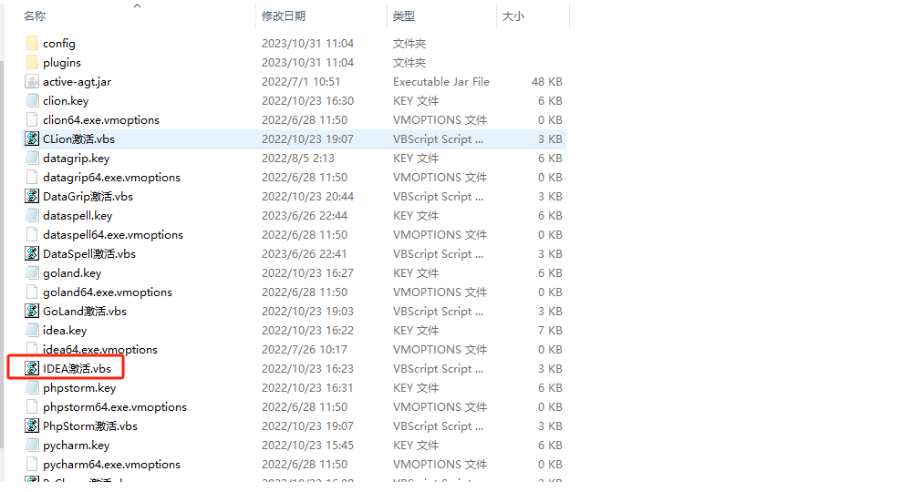
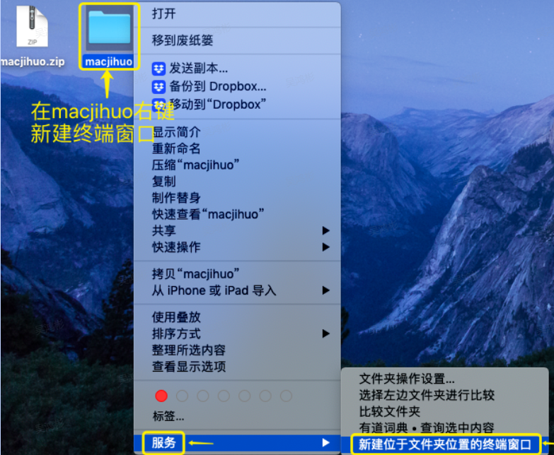
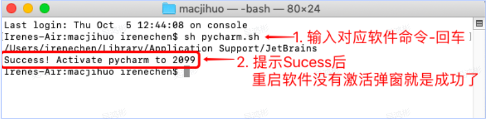

---
tags:
  - 开发工具
  - idea正版
---

# 常用的idea插件推荐

> 本文作者：[程序员Aurora](/author.md)
>
> 本站地址：[https://codenote.wuhobin.top](https://codenote.wuhobin.top)

## 1. Idea for windows 激活方法

windows激活工具下载： [windows激活工具下载](https://www.lanzouw.com/b05l2ekra)
密码:95ys

下载之后 解压文件夹到任意位置，文件内容如下：

关掉未激活的idea，打开文件夹，双击执行idea.vbx脚本文件，即可激活成功。

## 2. Idea for mac 激活方法

#### 2.1 mac激活工具下载

mac激活工具下载： [mac激活工具下载](https://www.lanzouw.com/b05l2ekra)

密码:95ys

下面3个链接也可以下载，复制链接到浏览器打开下载

蓝奏云下载：[https://www.lanzouh.com/i6XDN1mh4x9c](https://www.lanzouh.com/i6XDN1mh4x9c)

123盘下载：[https://www.123pan.com/s/N4BlVv-b52od.html](https://www.123pan.com/s/N4BlVv-b52od.html)

百度网盘：[https://pan.baidu.com/s/1sFMOyOZUDXDWEI0WTD5yhw](https://pan.baidu.com/s/1sFMOyOZUDXDWEI0WTD5yhw)  提取码：6666

#### 2.2 桌面"macjihuo"文件右键，新建终端窗口

> 备注：激活成功后，"macjihuo"文件是可以删除的哈

#### 2.3 运行脚本，输入对应软件的命令-回车（看下图）
运行命令前：先打开你要激活的软件。然后关闭软件，最后输入命令激活软件哦。

如果你要激活idea：        则输入   sh idea.sh

如果你要激活pycharm：  则输入   sh pycharm.sh

如果你要激活datagrip：  则输入   sh datagrip.sh

如果你要激活clion：       则输入   sh clion.sh

如果你要激活goland：    则输入   sh goland.sh

如果你要激活webstorm   则输入   sh webstorm.sh

如果你要激活phpstorm   则输入   sh phpstorm.sh

如果你要激活dataspell    则输入   sh dataspell.sh

如果你要激活rider          则输入   sh rider.sh

备用链接： [备用链接](https://hwmgu1yf37x.feishu.cn/docx/Jzszdsm7yobPifxsPpjc3nFbn7f)

<Vssue :title="$title" />