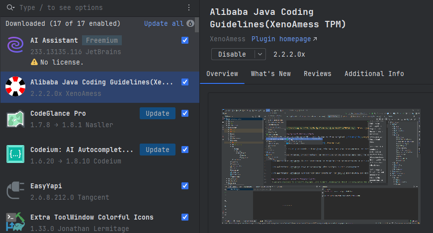
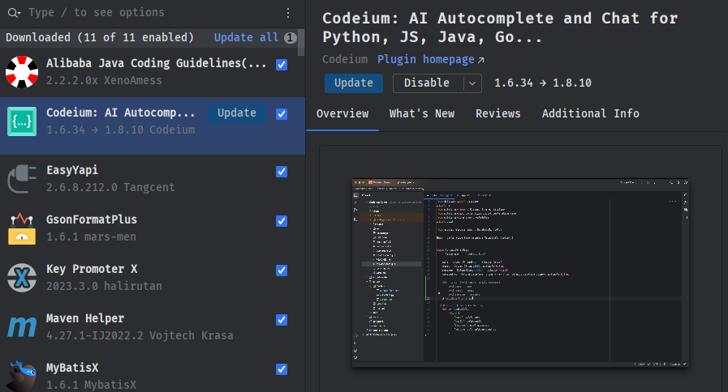
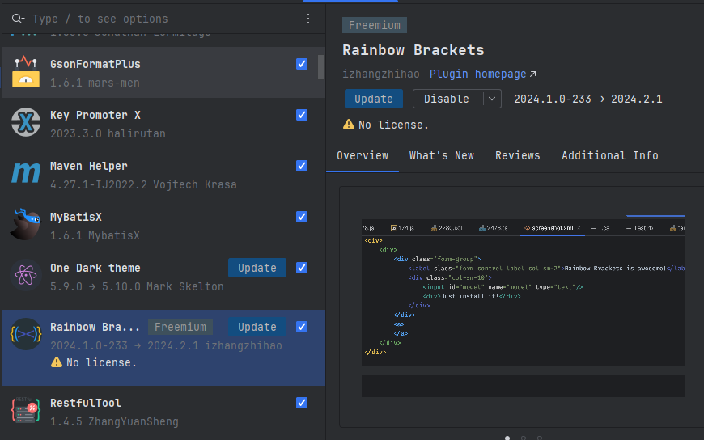
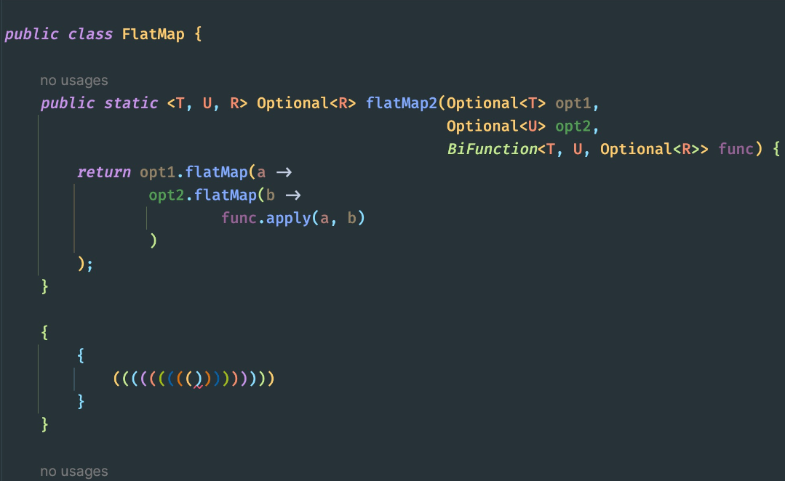
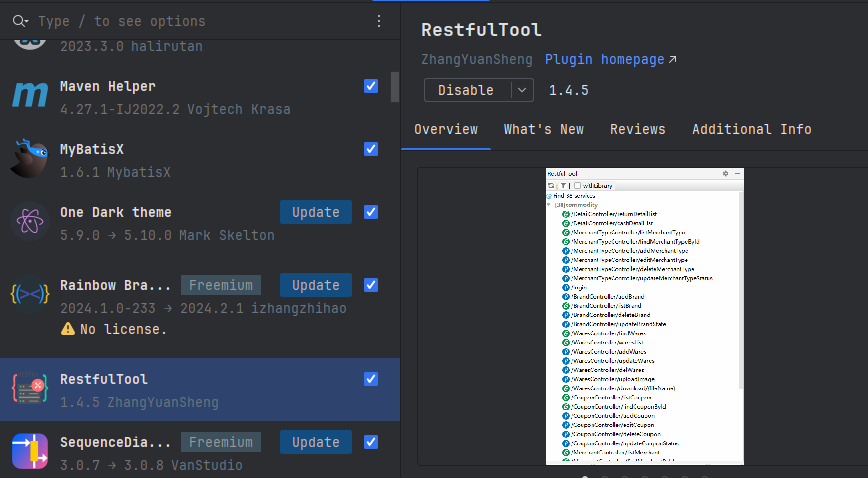
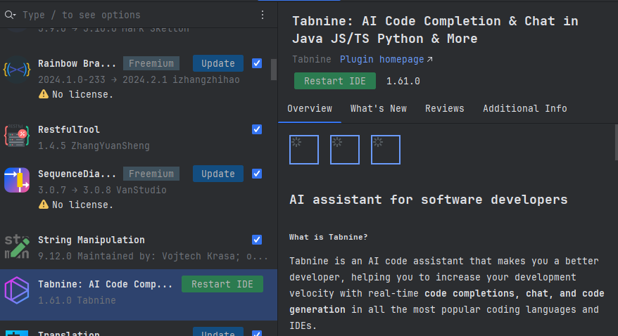

---
tags:
  - 开发工具
---

# 常用的idea插件推荐

> 本文作者：[程序员Aurora](/author.md)
>
> 本站地址：[https://codenote.wuhobin.top](https://codenote.wuhobin.top)

> 背景：该文章所有的插件都是基于IntelliJ IDEA 2023.3.4 

## 推荐以下插件

### 1. Alibaba Java Coding Guidelines（阿里巴巴Java开发规约）

> 通过该插件可以在开发的时候，所写的代码需要严格遵守阿里巴巴代码开发规范进行，否则将会有代码提示

推荐理由：阿里巴巴Java开发规范配套插件（p3c），现已成为Java工程师必备工具，无需多言。

推荐等级：⭐️⭐️⭐️⭐️⭐️

插件地址：`https://plugins.jetbrains.com/plugin/14109-alibaba-java-coding-guidelines-xenoamess-tpm-`

###  2. Codeium: AI Autocomplete and Chat for Python,​ JS,​ Java,​ Go.​.​.​

> 通过该插件可以在编写相关代码的时候出现代码提示，会根据笔者编写代码的习惯进行ai代码提示，所提示的代码符合代码开发时上下文规范

推荐理由：Codeium 是现代编码的超级力量，是一个基于尖端人工智能技术构建的免费代码加速工具包。 目前，Codeium 提供 70 多种语言的代码补全工具，具有闪电般的速度和最先进的建议质量。

推荐等级：⭐️⭐️⭐️⭐️⭐️

插件地址：`https://plugins.jetbrains.com/plugin/20540-codeium-ai-autocomplete-and-chat-for-python-js-java-go--`

### 3. Maven Helper

> 通过该插件可以查看当前项目maven依赖的依赖树，以便于方便查看依赖冲突并且直接排除掉冲突的依赖

推荐理由：使用maven构建项目时所必须要有的依赖。

推荐等级：⭐️⭐️⭐️⭐️⭐️

插件地址：`https://plugins.jetbrains.com/plugin/7179-maven-helper`

### 4. Rainbow Brackets

> 该插件会让相关代码块所包括的括号为彩色成对出现，通过该插件可以更便利查阅代码。

推荐理由：给项目相关代码快提供彩色括号

推荐等级：⭐️⭐️⭐️⭐️⭐️

插件地址：`https://plugins.jetbrains.com/plugin/10080-rainbow-brackets`

效果图：

### 5. RestfulTool

> restful风格工具插件，通过该插件可以快速定位到某个controller相关的接口，以及直接查看该controller下面所有的接口路径

推荐理由：一键查看所有接口路径

推荐等级：⭐️⭐️⭐️⭐️

插件地址：`https://plugins.jetbrains.com/plugin/14280-restfultool`

### 6. Tabnine: AI Code Completion & Chat in Java JS/TS Python & More

> Tabnine 是一款 AI 代码助手，可让您成为更好的开发人员，通过所有最流行的编码语言和 IDE 中的实时代码完成、聊天和代码生成来帮助您提高开发速度

推荐理由：智能AI代码生成插件

推荐等级：⭐️⭐️⭐️⭐️⭐️

插件地址：`https://plugins.jetbrains.com/plugin/12798-tabnine-ai-code-completion--chat-in-java-js-ts-python--more`