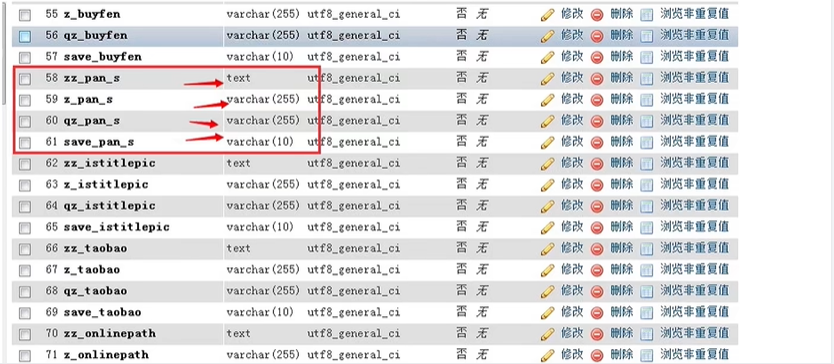
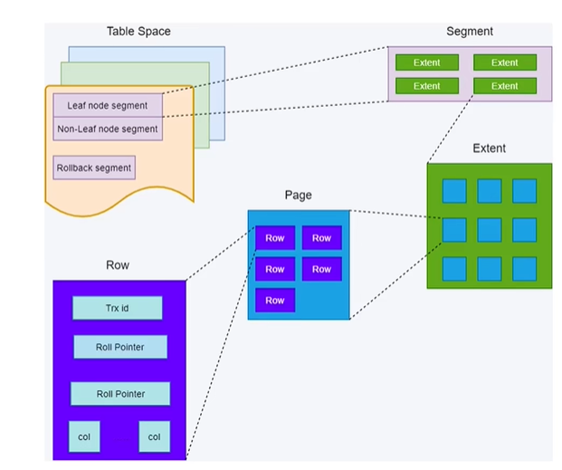

---
tags:
  - Mysql 
  - 分库分表
---

# 为什么大厂要做垂直分表？


> 本文作者：[程序员Aurora](/author.md)
>
> 本站地址：[https://codenote.wuhobin.top](https://codenote.wuhobin.top)


大家好，我是程序员Aurora，今天主要跟大家聊聊Mysql数据库分库分表中的分表，在介绍这个问题之前，首先给大家介绍一下，什么是水分分表和垂直分表。

## 水平分表

水平分表（Horizontal Partitioning）是一种数据库设计和优化策略，用于将一个大表的数据分布到多个物理表中，以减轻单一表的压力，提高查询效率和系统的可扩展性。其核心思想是基于表中数据行的某个或某几个列的值，将表的数据行按一定规则划分成不同的子集，每个子集存储在一个单独的表中，这些表结构相同，只是存放的数据不同。

### 实现方式

具体实现方式可以有以下几种典型做法：

1. **哈希分表**：根据主键或其他标识符的哈希值决定数据行落在哪个分表中，比如使用模运算确定分区表的索引。
2. **范围分表**：按照某一列的范围值（如时间范围、数值范围等）将数据划分为多个表，每一区间的数据存放在一个表中。
3. **列表分表**：依据列的特定值集合进行分表，例如根据地区ID、用户类别等离散值将数据分配到不同的表中。

### 解决问题

水平分表的主要目的是：

- 减少单表的数据量，提高查询性能；
- 分摊大量数据带来的存储压力；
- 支持更大规模的数据处理能力，实现数据分布式存储和处理；
- 提升数据库系统的可扩展性，便于在多台服务器之间分配负载。

## 垂直分表

今天主要讲的就是咱们的一个垂直分表。<br />比如我现在拥有一张商品信息表，该表拥有100多个字段，也就是100多列：<br />


<br />我们直接通过该表进行查询操作，其查询效率是及其低下的，此时需要进行一个垂直拆分，那么什么是垂直分表呢？<br />**垂直分表（Vertical Partitioning）是另一种数据库设计和优化技术，它是指将一个具有大量列的大表，按照列的属性进行拆分，将原表的部分列移动到新的表中，形成两个或多个表。这些新表仍然共享同一个主键（通常是原表的主键），通过主键关联起来，共同构成完整的信息集。**<br />在进行垂直分表之前，我的sql语句可能长这样：

```sql
SELECT * FROM 商品表 WHERE 商品标题 = 'AD钙奶';
```
在进行垂直拆分之后，sql语句长这样：
```sql
SELECT * FROM 商品基本信息表 a, 商品详情信息表 b WHERE a.id = b.id AND a.商品标题 = 'AD钙奶';
```
那么就问产生问题：我一张表可以完成的事情，为什么需要两张表呢？

> 这就需要了解mysql的InnoDB处理引擎：
>  行数据称为：row<br />管理数据基本单位称为页：page；每一页的默认大小：16kb<br />保存页的单位称为区：Extent。<br />关系：区由连续页组成，页由连续行组成。1024/16=64(即：一个1M的区有64个页)




### 为什么垂直分表？


不进行垂直分表：<br />1行数据为1K，1页16K，即1页16条数据，1亿的数据需要625万页

垂直分表后：<br />1行数据为64字节（1K=1024字节），即1页256条数据，1亿的数据需要39万页。分页后的数据根据id等关系进行快速提取。<br />通过将重要字段单独剥离成小表，让每页容纳更多行数据，页减少后，缩小数据扫描范围，达到提高执行效率的目的。

字段放大小表的依据：<br />小表：数据查询、排序时需要的字段；高频访问的小字段<br />大表：低频访问字段；大字段

<Vssue :title="$title" />